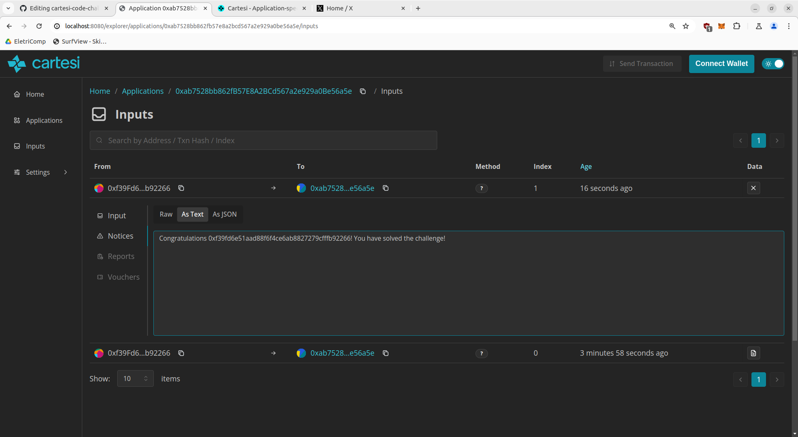

# Resolução - Cartesi Rollups Code Challenge
1. Análise do código: percebemos que o código fonte continha uma função obfuscada em python e percebemos pela nomenclatura das variáveis que precisávamos enviar o ano do nascimento de Descartés (nós da comunidade Cartesi somos Cartesianos!) subtraído de um outro valor que seria o guess.
2. Engenharia reversa: decompilamos o código binário e procuramos por constantes que pudessem nos indicar qual era o valor secreto. Porém devido a uma grande quantidade de instruções, deixamos essa estratégia de lado temporariamente.
3. Força bruta: executamos o código binário num script local que testava vários valores para o guess, porém devido às mensagens de erro quando a guess estavam erradas tivemos dificuldade em visualizar o momento em que a função retornava verdadeiro. Então reduzimos o número de tentativas e conseguimos achar o valor correto.
4. Double-check na engenharia reversa: reanalisando o código decompilado, vimos que as instruções LOAD_CONST indicavam poucos valores a serem testados (1, 2, 3 e 51). Como o valor correto estava entre esses valores, nos tornamos confiantes da solução.
5. Envio da solução: enviamos o valor achado localmente para a aplicação Cartesi e obtivemos nossa mensagem de sucesso: 
